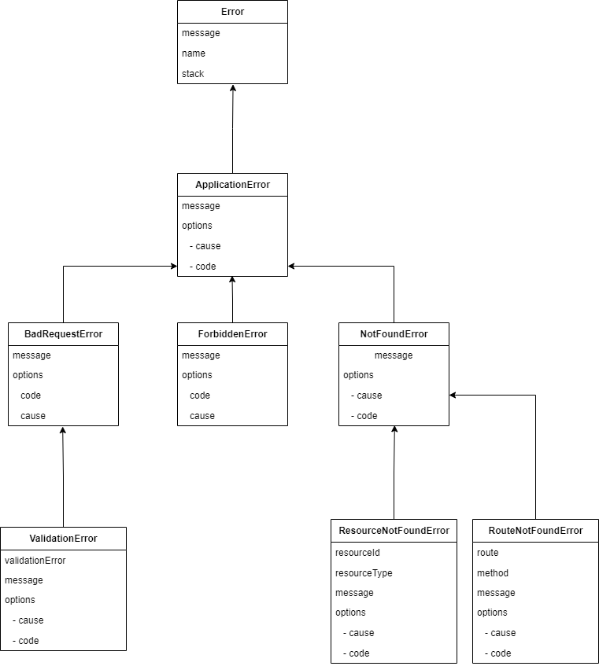

# error-lib

[![NPM version][npm-image]](https://npmjs.org/package/error-lib)
[![NPM downloads][downloads-image]](https://npmjs.org/package/error-lib)
[![Build Status][github-actions-publish-npm-package]](https://github.com/DManavi/error_lib/actions/workflows/publish_npm_package.yml)

## About

The error-lib project helps developers having a unified error structure in their NodeJS/Browser (JavaScript/TypeScript) projects.

## Installation

To install this package, run the command below.

```sh
# npm
npm install error-lib
# yarn
yarn add error-lib
# pnpm
pnpm add error-lib
```

## Diagram



## Usage

To use any of the custom error libraries you need to simply import them in your typescript/javascript application.

```js

// for NodeJS applications (Common JS)
const { ApplicationError, NotFoundError } = require('error-lib');

try {

  if (fileNotFound === true) {
    throw new NotFoundError('config.json was not found');
  }
}
catch (err) {

  if (err instanceof NotFoundError) {
    // 
  }
}

```

```ts

// For typescript/javascript (ES Module)
import { ApplicationError, NotFoundError } from 'error-lib';


```

## Extend / Custom errors


And you're good to go!

## License

MIT

[npm-image]: https://img.shields.io/npm/v/error-lib
[npm-url]: https://npmjs.org/package/error-lib
[github-actions-publish-npm-package]: https://github.com/DManavi/error_lib/actions/workflows/publish_npm_package.yml/badge.svg
[downloads-image]: https://img.shields.io/npm/dw/error-lib
[downloads-url]: https://npmjs.org/package/error-lib
